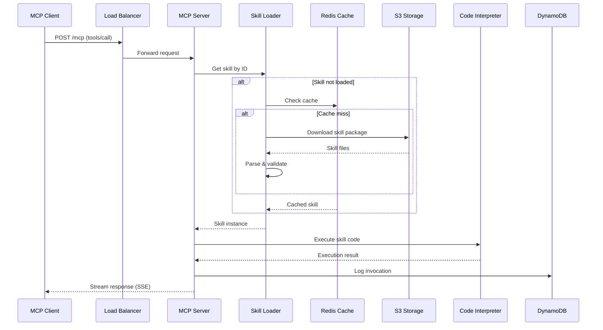
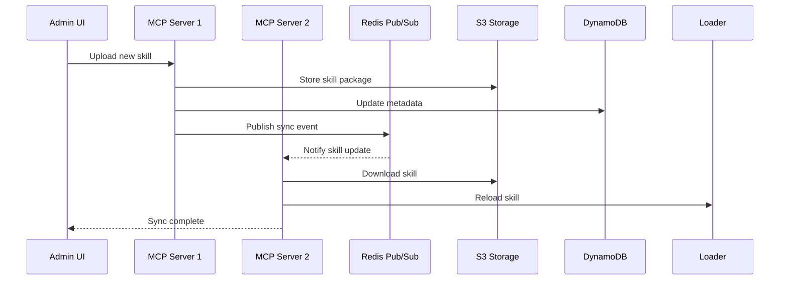

# Open MCP Skills

<div align="center">

**云原生 MCP 服务器 - Skills as a Service**

[](LICENSE)
[](https://www.python.org/downloads/)
[](https://fastapi.tiangolo.com/)
[](https://reactjs.org/)

[English](#english) | [中文](#chinese)

</div>

---

## 📖 项目简介

Open MCP Skills 是一个**云原生、可动态扩展**的 MCP (Model Context Protocol) 服务器,提供 **Skills as a Service** 能力。它允许 AI 应用(如 Claude Code、自定义 AI Agent)通过标准化的 MCP 协议调用云端托管的技能服务。

### 核心特性

- 🎯 **标准化**: 完全兼容 [Claude Skills 标准](https://docs.anthropic.com/en/docs/claude-skills)
- ☁️ **云原生**: 容器化部署,支持弹性伸缩和多实例同步
- 🔄 **实时管理**: Web 界面实时管理技能,无需重启服务
- 🔒 **安全隔离**: 沙箱执行环境,密钥安全管理
- 🚀 **高性能**: 懒加载机制,预热缓存,毫秒级响应
- 📦 **丰富技能库**: 内置 20+ 生产级技能(文档处理、代码生成、数据分析等)

### 技术亮点

- **懒加载 + 预热**: 启动时仅加载元数据,首次访问时按需加载,同时支持预热缓存
- **多存储后端**: 支持本地文件系统和 S3 + DynamoDB 云存储
- **实时同步**: 基于 Redis Pub/Sub 的多实例技能同步
- **代码解释器**: 集成 AWS Bedrock Code Interpreter,支持安全的代码执行
- **可观测性**: 完整的日志、指标和调用追踪

---

## 🏗️ 系统架构

### 架构概览

```
┌─────────────────────────────────────────────────────────────────────┐
│                         MCP Clients                                  │
│              (Claude Code, AI Agents, Custom Apps)                   │
└─────────────────────────┬───────────────────────────────────────────┘
                          │ Streamable HTTP (MCP Protocol)
                          ▼
┌─────────────────────────────────────────────────────────────────────┐
│                    Application Load Balancer                         │
│                         (AWS ALB / HTTPS)                            │
└─────────────────────────┬───────────────────────────────────────────┘
                          │
        ┌─────────────────┼─────────────────┐
        ▼                 ▼                 ▼
┌──────────────┐  ┌──────────────┐  ┌──────────────┐
│  MCP Server  │  │  MCP Server  │  │  MCP Server  │
│  Instance 1  │  │  Instance 2  │  │  Instance N  │
│   (Fargate)  │  │   (Fargate)  │  │   (Fargate)  │
└──────┬───────┘  └──────┬───────┘  └──────┬───────┘
       │                 │                 │
       └────────────┬────┴────┬────────────┘
                    │         │
        ┌───────────▼───┐ ┌───▼───────────┐
        │     Redis     │ │   DynamoDB    │
        │   (Pub/Sub)   │ │  (Metadata)   │
        └───────────────┘ └───────────────┘
                    │
            ┌───────▼───────┐
            │      S3       │
            │ (Skills存储)  │
            └───────────────┘
```

### 核心组件

| 组件 | 技术栈 | 说明 |
|------|--------|------|
| **后端服务** | Python 3.11 + FastAPI | MCP 协议处理、技能管理 |
| **前端管理** | React 18 + Vite | 技能管理界面 |
| **MCP 协议** | mcp-python SDK | 官方 Python SDK |
| **容器化** | Docker + ECS Fargate | 无服务器容器部署 |
| **负载均衡** | AWS ALB | HTTPS 终止、健康检查 |
| **缓存同步** | Redis 7 | Pub/Sub 多实例同步 |
| **元数据存储** | DynamoDB | 技能元数据、调用统计 |
| **文件存储** | S3 | 技能包存储 |
| **代码执行** | Bedrock Code Interpreter | 安全的代码沙箱 |

---

## 📊 时序图

### 技能调用流程



### 技能同步流程



---

## 💡 方案优势

### 1. 灵活的技能导入方式 🎯

支持三种技能上传方式,极大降低技能创建门槛:

#### 方式一: GitHub 链接导入
```bash
# 直接从开放的 GitHub 仓库导入技能
https://github.com/username/my-skill
```
- 自动克隆仓库并解析 SKILL.md
- 支持公开和私有仓库(需配置 Token)
- 自动跟踪更新,保持技能最新

#### 方式二: 本地 ZIP 包上传
```bash
# 上传打包好的技能 ZIP 文件
my-skill.zip
├── SKILL.md
├── generate.py
└── resources/
```
- 拖拽上传,即时生效
- 支持批量导入多个技能
- 自动验证格式和依赖

#### 方式三: 智能文档生成 ✨
```bash
# 从任意文档自动生成技能
- PDF 文档 → 自动提取知识并生成技能
- 网页链接 → 爬取内容并转换为技能
- Markdown → 直接解析为技能文档
```
- **AI 驱动**: 使用 LLM 自动分析文档内容
- **智能提取**: 识别关键信息、API 文档、代码示例
- **一键生成**: 自动创建 SKILL.md 和执行代码
- **适用场景**: 
  - 技术文档 → API 调用技能
  - 操作手册 → 自动化流程技能
  - 知识库 → 问答检索技能

**示例**: 上传 AWS SDK 文档 PDF,自动生成 AWS 操作技能

### 2. 性能优化

- **懒加载机制**: 启动时间从 5s 降至 200ms (减少 96%)
- **预热缓存**: 首次请求响应时间 < 50ms
- **批量操作**: DynamoDB 批量读取,减少 API 调用
- **本地缓存**: 技能文件本地缓存,避免重复下载

### 3. 可扩展性

- **水平扩展**: 支持多实例部署,自动负载均衡
- **动态技能**: 无需重启即可添加/更新技能
- **插件化架构**: 技能独立打包,互不影响
- **多租户支持**: 基于会话的隔离机制

### 4. 安全性

- **沙箱执行**: 代码在隔离环境中运行
- **权限控制**: 基于 IAM 的细粒度权限
- **密钥管理**: AWS Secrets Manager 安全存储
- **审计日志**: 完整的调用链追踪

### 5. 开发体验

- **标准化格式**: 兼容 Claude Skills 标准
- **热重载**: 开发模式下自动检测文件变化
- **在线编辑**: Web 界面直接编辑技能代码
- **丰富示例**: 20+ 生产级技能模板

### 6. 运维友好

- **健康检查**: 自动故障检测和恢复
- **可观测性**: CloudWatch 日志和指标
- **容器化**: 一键部署,环境一致性
- **成本优化**: Fargate 按需计费,无闲置成本

---

## 🚀 快速开始

### 前置要求

- Python 3.11+
- Node.js 18+
- Docker & Docker Compose
- AWS 账号 (生产环境)

### 本地开发

#### 1. 克隆项目

```bash
git clone https://github.com/yourusername/open-mcp-skills.git
cd open-mcp-skills
```

#### 2. 启动后端服务

```bash
# 使用 Docker Compose (推荐)
docker-compose up -d

# 或手动启动
cd backend
pip install -e .
python -m app.main
```

后端服务将在 `http://localhost:8000` 启动

#### 3. 启动前端管理界面

```bash
cd frontend
npm install
npm run dev
```

前端界面将在 `http://localhost:5173` 启动

#### 4. 测试 MCP 连接

```bash
# 健康检查
curl http://localhost:8000/health

# 列出所有技能
curl http://localhost:8000/admin/skills

# MCP 协议测试
curl -X POST http://localhost:8000/mcp \
  -H "Content-Type: application/json" \
  -d '{"jsonrpc":"2.0","id":1,"method":"tools/list"}'
```

### 配置 Claude Code

在 Claude Code 中添加 MCP 服务器:

```json
{
  "mcpServers": {
    "open-mcp-skills": {
      "url": "http://localhost:8000/mcp",
      "transport": "streamable-http"
    }
  }
}
```

---

## 📦 内置技能

项目包含 20+ 生产级技能,涵盖多个领域:

### 文档处理
- **docx**: Word 文档创建、编辑、分析
- **pdf**: PDF 生成、合并、拆分、OCR
- **pptx**: PowerPoint 演示文稿生成
- **xlsx**: Excel 表格处理

### 开发工具
- **mcp-builder**: MCP 服务器开发指南
- **skill-creator**: 技能开发脚手架
- **frontend-design**: 前端组件设计
- **webapp-testing**: Web 应用测试

### AI 框架
- **strandsagents**: Strands Agents 文档
- **google-agents**: Google Agents 架构
- **prompt-engineering**: 提示工程最佳实践
- **aidlc-workflows**: AI 开发生命周期

### 创意设计
- **canvas-design**: 海报设计
- **algorithmic-art**: 算法艺术生成
- **slack-gif-creator**: Slack GIF 制作
- **theme-factory**: 主题样式生成

### 其他
- **internal-comms**: 内部沟通文档
- **brand-guidelines**: 品牌规范
- **doc-coauthoring**: 文档协作

---

## 🔧 配置说明

### 环境变量

后端服务支持以下环境变量:

```bash
# 基础配置
ENVIRONMENT=development          # 环境: development/production
DEBUG=true                       # 调试模式
LOG_LEVEL=INFO                   # 日志级别

# 存储配置
STORAGE_BACKEND=local            # 存储后端: local/s3
SKILLS_DIR=/app/skills           # 本地技能目录
SKILLS_WATCH_ENABLED=true        # 文件监控

# S3 配置 (STORAGE_BACKEND=s3 时)
S3_SKILLS_BUCKET=mcp-skills      # S3 存储桶
S3_ENDPOINT_URL=                 # S3 端点 (可选)
SKILL_CACHE_DIR=/tmp/skill-cache # 本地缓存目录

# DynamoDB 配置
DYNAMODB_ENDPOINT_URL=           # DynamoDB 端点 (可选)
DYNAMODB_TABLE_PREFIX=mcp-       # 表名前缀

# Code Interpreter 配置
CODE_INTERPRETER_ENABLED=false   # 启用代码解释器
CODE_INTERPRETER_ID=             # Bedrock Code Interpreter ID
CODE_INTERPRETER_S3_BUCKET=      # 代码执行 S3 存储桶

# AWS 配置
AWS_REGION=us-east-1             # AWS 区域
AWS_ACCESS_KEY_ID=               # AWS 访问密钥
AWS_SECRET_ACCESS_KEY=           # AWS 密钥
```

### 存储模式

#### 本地模式 (开发)

```yaml
# docker-compose.yml
environment:
  - STORAGE_BACKEND=local
  - SKILLS_DIR=/app/skills
volumes:
  - ./backend/skills:/app/skills:ro
```

#### S3 模式 (生产)

```yaml
environment:
  - STORAGE_BACKEND=s3
  - S3_SKILLS_BUCKET=your-bucket
  - AWS_REGION=us-east-1
```

---

## 📚 部署指南

### Docker 部署

#### 1. 构建镜像

```bash
# 后端
cd backend
docker build -t open-mcp-skills-backend .

# 前端
cd frontend
docker build -t open-mcp-skills-frontend .
```

#### 2. 运行容器

```bash
docker-compose up -d
```

### AWS ECS Fargate 部署

#### 1. 准备 AWS 资源

```bash
# 创建 S3 存储桶
aws s3 mb s3://your-mcp-skills-bucket

# 创建 DynamoDB 表
aws dynamodb create-table \
  --table-name mcp-skills-metadata \
  --attribute-definitions \
    AttributeName=skill_id,AttributeType=S \
  --key-schema \
    AttributeName=skill_id,KeyType=HASH \
  --billing-mode PAY_PER_REQUEST

# 创建 ECR 仓库
aws ecr create-repository --repository-name open-mcp-skills
```

#### 2. 推送镜像

```bash
# 登录 ECR
aws ecr get-login-password --region us-east-1 | \
  docker login --username AWS --password-stdin \
  <account-id>.dkr.ecr.us-east-1.amazonaws.com

# 标记并推送
docker tag open-mcp-skills-backend:latest \
  <account-id>.dkr.ecr.us-east-1.amazonaws.com/open-mcp-skills:latest
docker push <account-id>.dkr.ecr.us-east-1.amazonaws.com/open-mcp-skills:latest
```

#### 3. 部署到 ECS

使用提供的部署脚本:

```bash
# 配置环境变量
cp .env.deploy.example .env.deploy
# 编辑 .env.deploy 填入你的配置

# 部署后端
./deploy-backend.sh

# 部署前端
./deploy-frontend.sh
```

或手动创建 ECS 任务定义和服务。

### Kubernetes 部署

```bash
# 应用 Kubernetes 配置
kubectl apply -f k8s/

# 检查部署状态
kubectl get pods -n mcp-skills
kubectl get svc -n mcp-skills
```

---

## 🧪 测试

### 运行测试

```bash
cd backend

# 运行所有测试
pytest

# 运行特定测试
pytest tests/test_mcp.py

# 生成覆盖率报告
pytest --cov=app --cov-report=html
```

### 性能测试

```bash
# 懒加载性能测试
python tests/test_lazy_loading.py

# 批量操作基准测试
python tests/benchmark_lazy_loading.py
```

---

## 📖 开发文档

### 添加新技能

1. 在 `backend/skills/` 创建技能目录
2. 添加 `SKILL.md` 文件(包含 YAML frontmatter)
3. 添加技能代码和资源文件
4. 重启服务或等待热重载

示例技能结构:

```
backend/skills/my-skill/
├── SKILL.md           # 技能定义
├── generate.py        # 代码入口 (可选)
├── scripts/           # 辅助脚本
└── resources/         # 资源文件
```

`SKILL.md` 格式:

```markdown
---
name: my-skill
description: "技能描述"
execution:
  type: code_interpreter
  runtime: python
  timeout: 60
---

# 技能文档

技能使用说明...
```

### API 文档

启动服务后访问:
- Swagger UI: `http://localhost:8000/docs`
- ReDoc: `http://localhost:8000/redoc`

### 项目结构

```
open-mcp-skills/
├── backend/                 # 后端服务
│   ├── app/
│   │   ├── api/            # API 路由
│   │   ├── core/           # 核心配置
│   │   ├── models/         # 数据模型
│   │   └── services/       # 业务逻辑
│   ├── skills/             # 技能库
│   ├── tests/              # 测试
│   └── Dockerfile
├── frontend/               # 前端管理界面
│   ├── src/
│   │   ├── components/     # React 组件
│   │   ├── pages/          # 页面
│   │   └── lib/            # 工具函数
│   └── Dockerfile
├── docs/                   # 文档
├── scripts/                # 部署脚本
├── docker-compose.yml      # 本地开发
└── README.md
```

---

## 🤝 贡献指南

欢迎贡献代码、报告问题或提出建议!

1. Fork 项目
2. 创建特性分支 (`git checkout -b feature/AmazingFeature`)
3. 提交更改 (`git commit -m 'Add some AmazingFeature'`)
4. 推送到分支 (`git push origin feature/AmazingFeature`)
5. 开启 Pull Request

---

## 📄 许可证

本项目采用 MIT 许可证 - 详见 [LICENSE](LICENSE) 文件

---

## 🙏 致谢

- [Anthropic](https://www.anthropic.com/) - Claude Skills 标准
- [Model Context Protocol](https://modelcontextprotocol.io/) - MCP 协议规范
- [FastAPI](https://fastapi.tiangolo.com/) - 现代 Python Web 框架
- [React](https://reactjs.org/) - 前端框架

---

## 📞 联系方式

- 项目主页: [GitHub](https://github.com/yourusername/open-mcp-skills)
- 问题反馈: [Issues](https://github.com/yourusername/open-mcp-skills/issues)
- 讨论区: [Discussions](https://github.com/yourusername/open-mcp-skills/discussions)

---

<div align="center">

**⭐ 如果这个项目对你有帮助,请给个 Star!**

Made with ❤️ by Open MCP Skills Team

</div>
